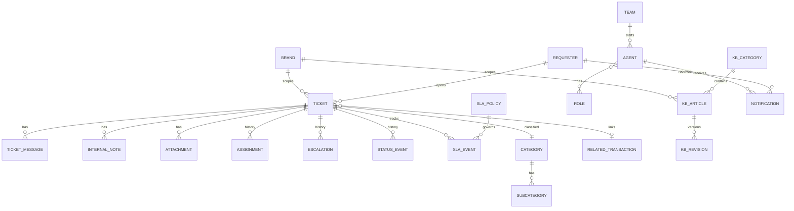

# Mock Data Model (Contract-Shaped)

Typed TypeScript models for the mock layer, shaped so a **real API can adopt
them without frontend redesign**. Illustrative — not final. Derived from §8.

## Principles

- Exported from a shared **`models`** module; all seed data conforms to it.
- **IDs and references are opaque strings**, never array indices.
- **Status and `escalationState` are independent** fields (see
  [`product-rules.md`](product-rules.md)).
- **`InternalNote` is a distinct entity** from `TicketMessage` so it can never
  leak into requester-facing views.
- Time fields are ISO strings; the simulated clock (see
  [`sla-simulation.md`](sla-simulation.md)) computes relative/SLA state.

## Entity relationships



## Key entities (abbreviated)

```ts
// Six core statuses (product rule #3). "Pending Requester" folded into
// on_hold + holdReason; "Reopened" became an event flag, not a status.
type TicketStatus =
  | 'new' | 'open' | 'in_progress' | 'on_hold' | 'resolved' | 'closed';
type HoldReason =
  | 'waiting_requester' | 'waiting_internal' | 'waiting_third_party'
  | 'scheduled_follow_up' | 'other';
type TicketPriority = 'normal' | 'high' | 'urgent';   // no 'low'
type EscalationState = 'none' | 'escalated' | 'returned_to_l1';
type SupportTier = 'L1' | 'L2';
type TicketSource = 'web' | 'email' | 'transaction' | 'api' | 'internal';

interface Ticket {
  id: string; reference: string; brandId: string; requesterId: string;
  subject: string; description: string;
  categoryId: string; subcategoryId: string;
  status: TicketStatus;            // workflow status …
  holdReason?: HoldReason;         // … only meaningful while on_hold
  reopenedAt?: string;             // reopen is an EVENT, not a status
  escalationState: EscalationState; // … independent of escalation
  supportTier: SupportTier; teamId: string;
  priority: TicketPriority; severity?: string;
  resolutionType?: string; source: TicketSource;
  assigneeId?: string; relatedTransactionId?: string; slaPolicyId: string;
  createdAt: string; updatedAt: string;
  firstResponseAt?: string; resolvedAt?: string; escalatedAt?: string;
}

// The GGX tracking number lives on RelatedTransaction (a ticket links a
// transaction by id, product rule #14) and is DENORMALIZED onto the list view
// model so every ticket table can show it without an extra lookup.
// Format: XXXX-XXXX-XXXX  →  /^[A-Z0-9]{4}-[A-Z0-9]{4}-[A-Z0-9]{4}$/
interface TicketListItem {
  ticket: Ticket;
  requesterName: string; teamName: string; categoryName: string;
  assigneeName?: string;
  trackingNumber?: string;         // absent on non-shipment tickets → "—"
  sla: SlaSummary;
}

// Public conversation — visibility is always 'public'.
interface TicketMessage {
  id: string; ticketId: string;
  authorType: 'requester' | 'agent' | 'system'; authorId: string;
  body: string; channel: 'web' | 'email'; visibility: 'public'; createdAt: string;
}

// Separate type — NEVER surfaced to requesters.
interface InternalNote {
  id: string; ticketId: string; agentId: string; body: string; createdAt: string;
}

interface StatusEvent { ticketId: string; actor: string; fromStatus: TicketStatus; toStatus: TicketStatus; note?: string; timestamp: string; }
interface Assignment  { ticketId: string; actor: string; fromAssigneeId?: string; toAssigneeId: string; fromTeamId?: string; toTeamId: string; timestamp: string; }

// The escalation history the Escalated Tickets view filters on.
interface Escalation {
  ticketId: string; actor: string; direction: 'escalate' | 'de-escalate';
  fromTier: SupportTier; toTier: SupportTier; fromTeamId: string; toTeamId: string;
  reason: string; note: string; timestamp: string;
}

interface SlaPolicy { id: string; targetFirstResponse: number; targetResolution: number; businessHoursId: string; priority: string; }
interface SlaEvent  { ticketId: string; type: 'started' | 'paused' | 'resumed' | 'warned' | 'breached'; elapsedMs: number; timestamp: string; }

interface Requester { id: string; name: string; email: string; mobile?: string; isGuest: boolean; linkedCustomerId?: string; brandId: string; }

// Models a secure-link/token grant. Reference alone does NOT grant access.
interface RequesterAccess { ticketId: string; accessToken: string; issuedAt: string; expiresAt?: string; }

interface KbArticle {
  id: string; brandId: string; kbCategoryId: string; slug: string;
  title: string; body: string; status: 'draft' | 'published';
  visibility: 'public' | 'internal'; ownerId: string; order: number;
  publishedAt?: string; updatedAt: string;
}
interface KbRevision { articleId: string; editorId: string; snapshot: string; createdAt: string; }

interface RelatedTransaction { ticketId: string; trackingNumber?: string; orderId?: string; shipmentStatus?: string; metadata?: Record<string, unknown>; }
interface Attachment { id: string; ticketId: string; name: string; size: number; type: string; }
interface Notification { id: string; recipientId: string; event: string; ticketId?: string; channel: 'in-app' | 'email-sim'; read: boolean; createdAt: string; }
```

## Invariants encoded here

- `Ticket.status` and `Ticket.escalationState` vary independently — a ticket can
  be `in_progress` while `escalationState = 'escalated'`.
- `InternalNote` has no `visibility: 'public'` path and no requester-facing
  serializer.
- `RequesterAccess.accessToken` (not `reference`) is what `/t/:token` resolves.
- `brand`/`brandId` is present where it prevents later rework; no multi-brand
  partitioning behavior is built.

Seed data is authored in `data/*`; components reach it **only** via the services
in [`mock-service-layer.md`](mock-service-layer.md).

## Phase 2 additions (planned — M13–M18)

Additive, backward-compatible extensions built once Phase 2 lands (see
[`roadmap.md`](roadmap.md) and §21). All remain contract-shaped and reachable
**only** through typed services.

### Ticket — new fields (M15/M16)

```ts
type TicketSource =
  | 'web' | 'email' | 'transaction' | 'api' | 'internal'; // 'internal' added M16

type ConcernType =                                        // M15 — separate field
  | 'delivery_delay' | 'pickup_issue' | 'missing_parcel' | 'damaged_parcel'
  | 'cod_concern' | 'remittance_concern' | 'payment_issue' | 'booking_issue'
  | 'address_correction' | 'account_concern' | 'general_inquiry';

interface Ticket {
  // …all existing fields…
  concernType?: ConcernType;          // M15 — distinct from category/status/etc.
  reporterId?: string;                // M16 — submitting employee for internal tickets
  requesterNotificationsEnabled?: boolean; // M16 — default false for source==='internal'
}
```

`concernType` is a **separate** field (never merged with category/subcategory/
status/priority/escalationState/teamId — product rule #16). For `source ==
'internal'`, `requesterNotificationsEnabled` defaults to **false**; it may be set
true only when an external `requesterId` is attached and an agent opts in
(rules 17–18). Creator attribution flows through the existing audit/timeline
events (a `StatusEvent`/creation event with `actor = reporterId`).

### RelatedTransaction — expanded GGX context (M13)

Replaces the MVP pass-through shape with the full agent-facing detail set. Sender
and recipient are **masked** for display (rule #15). The three statuses are
**independent** of the ticket's workflow status (rule #13).

```ts
type ShipmentStatus =
  | 'booked' | 'picked_up' | 'in_transit' | 'out_for_delivery'
  | 'delivered' | 'failed_delivery' | 'returned' | 'cancelled' | 'on_hold';
type PaymentStatus   = 'unpaid' | 'paid' | 'refunded' | 'failed';
type RemittanceStatus = 'not_applicable' | 'pending' | 'remitted' | 'on_hold';

interface RelatedTransaction {
  ticketId: string;
  trackingNumber: string;
  shipmentStatus: ShipmentStatus;      // delivery/shipment status
  origin: string; destination: string;
  senderMasked: string; recipientMasked: string;   // PII masked (rule #15)
  bookingDate?: string; pickupDate?: string;
  deliveryDate?: string; latestMovementAt?: string;
  shippingFee?: number; charges?: { label: string; amount: number }[];
  paymentMethod?: string; paymentStatus: PaymentStatus;
  codAmount?: number; remittanceStatus: RemittanceStatus; // when applicable
  exceptions?: { type: 'failed_attempt' | 'return' | 'cancellation' | 'exception';
                 reason?: string; at: string }[];
  dataSource: string;                  // e.g. 'GGX Xpress (mock)'
  lastUpdatedAt: string;               // freshness for the stale-data state
}
```

**Fetch/UI states** the transaction panel must model (simulated in the mock):
`loading`, `invalid_tracking` (unmatched), `unavailable`, `stale` (compared to
`lastUpdatedAt`), `refreshing` (manual refresh), `permission_mismatch`
(ownership), and `multiple_matches` (disambiguation list). These are view/service
states, not persisted fields.

**Linkage:** a ticket links a transaction via `relatedTransactionId` (structured
context, not description text — rule #14), populated from a report-from-
transaction, a contact-form tracking number, agent manual entry/search, or an
integration-supplied transaction ID.
