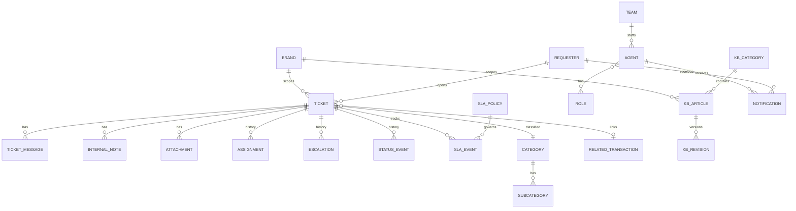

# Mock Data Model (Contract-Shaped)

Typed TypeScript models for the mock layer, shaped so a **real API can adopt
them without frontend redesign**. Illustrative — not final. Derived from §8.

## Principles

- Exported from a shared **`models`** module; all seed data conforms to it.
- **IDs and references are opaque strings**, never array indices.
- **Status and `escalationState` are independent** fields (see
  [`product-rules.md`](product-rules.md)).
- **`InternalNote` is a distinct entity** from `TicketMessage` so it can never
  leak into requester-facing views.
- Time fields are ISO strings; the simulated clock (see
  [`sla-simulation.md`](sla-simulation.md)) computes relative/SLA state.

## Entity relationships



## Key entities (abbreviated)

```ts
type TicketStatus =
  | 'new' | 'open' | 'in_progress' | 'pending_requester'
  | 'resolved' | 'closed' | 'reopened';
type EscalationState = 'none' | 'escalated' | 'returned_to_l1';
type SupportTier = 'L1' | 'L2';
type TicketSource = 'web' | 'email' | 'transaction' | 'api';

interface Ticket {
  id: string; reference: string; brandId: string; requesterId: string;
  subject: string; description: string;
  categoryId: string; subcategoryId: string;
  status: TicketStatus;            // workflow status …
  escalationState: EscalationState; // … independent of escalation
  supportTier: SupportTier; teamId: string;
  priority: string; severity?: string;
  resolutionType?: string; source: TicketSource;
  assigneeId?: string; relatedTransactionId?: string; slaPolicyId: string;
  createdAt: string; updatedAt: string;
  firstResponseAt?: string; resolvedAt?: string; escalatedAt?: string;
}

// Public conversation — visibility is always 'public'.
interface TicketMessage {
  id: string; ticketId: string;
  authorType: 'requester' | 'agent' | 'system'; authorId: string;
  body: string; channel: 'web' | 'email'; visibility: 'public'; createdAt: string;
}

// Separate type — NEVER surfaced to requesters.
interface InternalNote {
  id: string; ticketId: string; agentId: string; body: string; createdAt: string;
}

interface StatusEvent { ticketId: string; actor: string; fromStatus: TicketStatus; toStatus: TicketStatus; note?: string; timestamp: string; }
interface Assignment  { ticketId: string; actor: string; fromAssigneeId?: string; toAssigneeId: string; fromTeamId?: string; toTeamId: string; timestamp: string; }

// The escalation history the Escalated Tickets view filters on.
interface Escalation {
  ticketId: string; actor: string; direction: 'escalate' | 'de-escalate';
  fromTier: SupportTier; toTier: SupportTier; fromTeamId: string; toTeamId: string;
  reason: string; note: string; timestamp: string;
}

interface SlaPolicy { id: string; targetFirstResponse: number; targetResolution: number; businessHoursId: string; priority: string; }
interface SlaEvent  { ticketId: string; type: 'started' | 'paused' | 'resumed' | 'warned' | 'breached'; elapsedMs: number; timestamp: string; }

interface Requester { id: string; name: string; email: string; mobile?: string; isGuest: boolean; linkedCustomerId?: string; brandId: string; }

// Models a secure-link/token grant. Reference alone does NOT grant access.
interface RequesterAccess { ticketId: string; accessToken: string; issuedAt: string; expiresAt?: string; }

interface KbArticle {
  id: string; brandId: string; kbCategoryId: string; slug: string;
  title: string; body: string; status: 'draft' | 'published';
  visibility: 'public' | 'internal'; ownerId: string; order: number;
  publishedAt?: string; updatedAt: string;
}
interface KbRevision { articleId: string; editorId: string; snapshot: string; createdAt: string; }

interface RelatedTransaction { ticketId: string; trackingNumber?: string; orderId?: string; shipmentStatus?: string; metadata?: Record<string, unknown>; }
interface Attachment { id: string; ticketId: string; name: string; size: number; type: string; }
interface Notification { id: string; recipientId: string; event: string; ticketId?: string; channel: 'in-app' | 'email-sim'; read: boolean; createdAt: string; }
```

## Invariants encoded here

- `Ticket.status` and `Ticket.escalationState` vary independently — a ticket can
  be `in_progress` while `escalationState = 'escalated'`.
- `InternalNote` has no `visibility: 'public'` path and no requester-facing
  serializer.
- `RequesterAccess.accessToken` (not `reference`) is what `/t/:token` resolves.
- `brand`/`brandId` is present where it prevents later rework; no multi-brand
  partitioning behavior is built.

Seed data is authored in `data/*`; components reach it **only** via the services
in [`mock-service-layer.md`](mock-service-layer.md).
