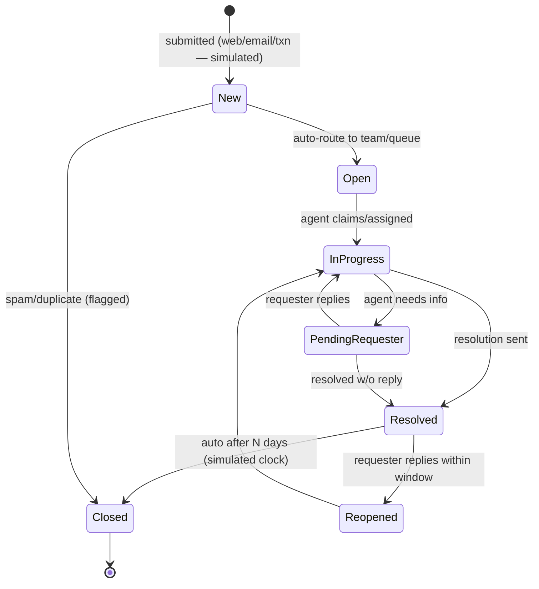
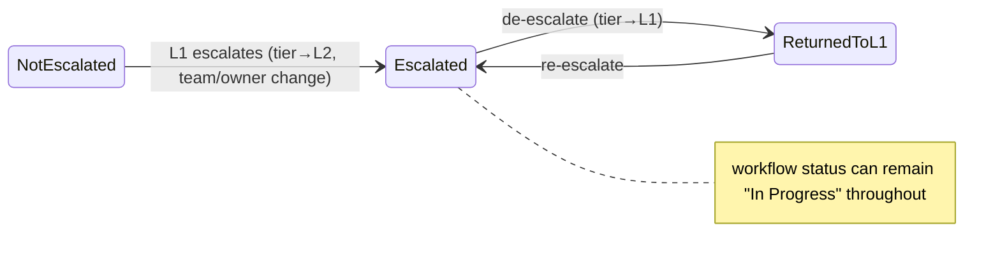
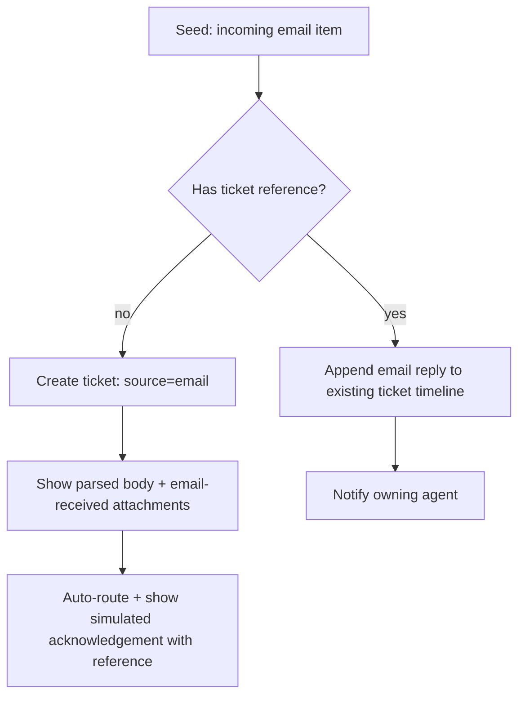
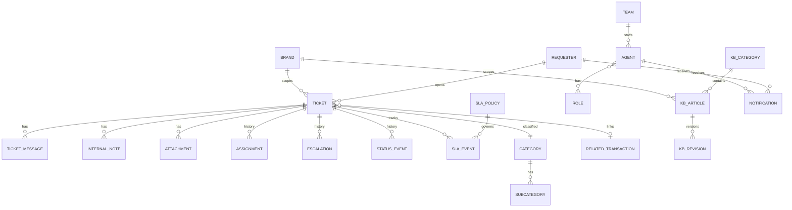

# QuadX Helpdesk Platform — First-Pass Planning & Feasibility Assessment

> **Status:** First-pass draft for cross-team review — **not approved for build**
> **MVP type:** Frontend-first, high-fidelity interactive prototype with realistic mock data and simulated workflows (same approach as GGX Corporate)
> **Audience:** Product, Support Operations, Design, Frontend Engineering, Brand
> **Scope of this document:** inspection, feasibility, and planning only. No code, dependencies, branches, or commits were created producing this assessment.

## How to read this document

This is a **first pass** intended to align teams before any implementation. The MVP described here is a **frontend-first prototype**: a fully navigable, high-fidelity helpdesk application built on the GGX Corporate stack, backed entirely by **mock data and simulated state** — no production backend, database, auth, or live email. Its purpose is to validate product scope, information architecture, workflows, roles-based UI, and QuadX theming so stakeholders can review a working experience before backend investment.

The document deliberately separates seven concerns so reviewers can tell what is being built now versus later:

1. **Frontend MVP scope** — what ships in the prototype (§9)
2. **Mocked / simulated functionality** — what looks real but is faked (§9a)
3. **Frontend interfaces prepared for future APIs** — the data-contract seams (§9b)
4. **Future backend productionization** — deferred (§17)
5. **Future system integrations** — deferred (§18)
6. **Post-MVP Zendesk migration** — deferred (§19)
7. **Post-MVP functional multi-brand support** — deferred (§20)

Open questions requiring a decision are consolidated in **§3** and **§15**, each with a recommended default so review can proceed without blocking.

**Team routing:** Product → §1, §5, §6, §9, §15 · Support Operations → §5, §6, §9, §14, §15 · Design → §4, §10 · Frontend Engineering → §2, §7, §8, §9b, §13 · Brand → §10, §16.

---

## Inspection basis (what was reviewed)

Per the corrected direction, only **GGX Corporate** and the **GGX SHADCN design system** are used as direct technical and UI references for this MVP.

**GGX Corporate** — a bulk-first business dashboard SPA, frontend-only, backed by a documented **mock service layer**. It is the template for this project's framework, structure, conventions, theming, and mock-data patterns.

- **Stack:** React 18, React Router 7, Tailwind v4 (`@tailwindcss/vite`), TypeScript, Vite 6, Recharts, Tabler icons.
- **SHADCN components:** `src/app/components/ui/` — 29 CVA-based components (Button, Dialog, Table, Tabs, Select, Combobox, Field, Badge, Breadcrumb, Pagination, PageHeader, Calendar, Popover, Tooltip, etc.) built with `cn()` + `class-variance-authority`.
- **Design tokens:** `tokens/tokens.json` → `scripts/build-tokens.mjs` → `src/styles/theme.css` (and Figma variables), single source of truth. Dark mode wired via `@custom-variant dark`.
- **Mock/service-layer pattern:** `src/app/services/*` are async facades over `src/app/data/*` module-state mocks, written to mirror a future real API contract (e.g. `ticketsService`, `slaService`, `notificationService`, `authService`, `claimsService`). Each service documents its future REST endpoints.
- **Existing helpdesk-adjacent UI/patterns to lean on:** `SupportTickets.tsx` / `SupportTicketDetail.tsx` (ticket list, detail, thread, reply, submit), `SlaAlerts.tsx`, Claims pages, `Notifications.tsx`, `UsersPermissions.tsx`, `AuthContext` (role-gated demo users), and established loading/empty/validation/table/form/navigation patterns.

**Note on the GGX ticket mock:** GGX Corporate's support tickets are a thin **Zendesk-facade mock** (a single stubbed sync point; conflated issueType/status/priority/assignee-as-string; no category/tier/queue/brand separation). Reuse it as a **visual and pattern reference only** — this project defines a fresh, normalized mock data model (§8).

> A separate QuadX backend platform exists in the wider organization and demonstrates production patterns (services, database-per-domain, event bus, object storage, identity, audit, deployment). It is **explicitly out of scope as an architectural foundation for this MVP** and is referenced only as one possible future reference during backend productionization (§17). It does not create any dependency for the frontend MVP.

---

## 1. Executive assessment

**Feasibility: High and low-risk.** A frontend-first, mock-data helpdesk prototype is directly achievable on the GGX Corporate stack using its existing conventions. GGX Corporate already demonstrates the exact approach — a high-fidelity SPA over an async mock service layer — and even ships helpdesk-adjacent screens (tickets, SLA alerts, notifications, users/permissions) that de-risk the UI work.

**What this MVP is:** a fully navigable, visually complete, interactive helpdesk experience — public help center, ticket submission, requester tracking, agent workspace, assignment/escalation, KB administration, agent/team administration, simulated notifications, operational reporting, role-based UI, QuadX theming, and light/dark modes — all driven by realistic mock data and simulated workflows in local state.

**What this MVP is not:** it is not a production ticketing backend, does not persist across users or sessions beyond simulated local state, does not enforce real security, and is **not positioned to replace Zendesk**. Those are explicitly deferred (§17–§20).

**Major considerations (all frontend/product, not infrastructure):**
1. **Mock data realism** — the prototype's value depends on believable seed data and state transitions (tickets flowing through statuses, SLA countdowns, escalations, notifications firing).
2. **Data-contract discipline** — mock service boundaries and TypeScript models must be shaped so a real API can slot in later without redesigning the frontend (§9b).
3. **Simulated roles** — role-based UI is driven by a switchable simulated identity, not real auth; the UI must still correctly gate views per role.
4. **Classification modeling** — keep concern category, support tier, priority, status, queue, and escalation state as **separate** fields even in mock data (§4-classification).
5. **QuadX red vs `destructive`** — the brand red must be visually distinct from the existing danger token so "brand" and "danger" never collide.
6. **Simulated email channel** — email-origin tickets, email replies on the timeline, and "sent via email" markers are demonstrated as UI states only; no mailbox, parsing, or threading infrastructure.

**Recommended approach:** build a new GGX-Corporate-style SPA in the **HeyQ project directory** (the confirmed target for this work) that reuses GGX SHADCN components, the token pipeline (with a QuadX red brand layer), and the async-mock-service pattern. Ship the twelve-milestone frontend program in §13. **GGX-only**; a **disabled** brand-switcher preview hints at the multi-brand future; a `brand` field may appear in mock models where it prevents later rework, but no tenant infrastructure is built.

---

## 2. Technical foundation & reuse (frontend only)

**Reference boundary:** GGX Corporate + GGX SHADCN only. No external backend, microservice, identity, database, or deployment references are part of this MVP.

**Reuse matrix (all frontend):**

| Area | Reuse directly from GGX Corporate | Extend / add | Build new |
|---|---|---|---|
| Framework & structure | Vite + React 18 + React Router 7 + TS project layout, `src/app/{components,services,pages,contexts,data,hooks,lib}` | New route tree for helpdesk areas | Public help-center + agent + admin route groups |
| SHADCN components | `components/ui/*` (Button, Dialog, Table, Tabs, Select, Combobox, Field, Badge, Pagination, PageHeader, Tooltip, Popover, Calendar…) | Helpdesk molecules composed from primitives | 3-pane agent ticket detail; KB article renderer |
| Theming | Token pipeline (`tokens.json` → `build-tokens.mjs` → `theme.css`) + `.dark` variant | **QuadX brand token layer** (red primary) | Disabled brand-switcher preview control |
| Mock/service layer | Async service-facade-over-module-state pattern; per-service "future endpoints" doc comments | New typed services & seed data (§8, §9b) | `mod`-style mock services for tickets, KB, routing, SLA, notifications, reporting |
| State/session | `AuthContext` role-gated demo-user pattern | **Simulated identity switcher** (role/tier/team) | Role-based UI gating helpers |
| UX patterns | Loading, empty, validation, table, form, pagination, navigation patterns | Timeline, internal-note, SLA badge, status chip, assignee picker | Requester portal states; KB editor states |
| Data viz | Recharts usage in analytics pages | Simple operational counters/charts | Ops dashboard tiles |

**Dependency policy.** Production **backend** dependencies are **prohibited** during the frontend MVP (no database drivers, server frameworks, auth SDKs, mail/queue/storage clients, etc.). **Minimal frontend-only dependencies may be introduced when justified** — for example a test runner and testing utilities, an accessibility-checking helper, an interaction/animation library that raises UI quality, or a small query/mutation abstraction. Each such dependency should be justified for testing, interaction quality, accessibility, or the query/mutation abstraction, and kept lightweight.

**Deliberate, minimal additions (justified):**
- A lightweight **client data-fetching/query hook layer** (or a thin equivalent) around the mock services so the eventual swap to real APIs is mechanical. GGX Corporate calls services directly; introducing a consistent query/mutation seam now avoids rework later. This is a frontend convenience only — no server.
- **Simulated-clock utility** for SLA countdowns and time-based state (e.g. auto-close, SLA warn/breach) so demos feel live without background jobs.
- A **minimal frontend test setup** for critical flows, plus optional accessibility/interaction-quality helpers where they earn their place.

**Frontend technical debt to avoid inheriting:**
- Do not carry GGX's flat Zendesk-facade ticket shape — model classification properly (§8).
- Do not rely on GGX's coarse two-role/boolean permission mock — use a richer simulated role/tier/team model for UI gating (§5).
- GGX has no test runner; add a minimal component/interaction test setup for the prototype's critical flows.

---

## 3. Assumptions & unresolved decisions

**Confirmed from the corrected direction:** frontend-first mock MVP; GGX Corporate + GGX SHADCN are the only references; GGX-only; brand switcher disabled; email simulated; all backend/integrations/Zendesk-migration deferred; mock models shaped for future API connection.

**Confirmed long-term architectural requirement (not an open decision):** HeyQ will eventually operate as a **standalone QuadX helpdesk platform** owning its own backend, database, authentication, file storage, notifications, audit history, search, and SLA processing. **Zendesk must never become a permanent runtime dependency or data source**, and the production version of HeyQ must work completely even if no Zendesk data is ever migrated. The specific backend framework and database technology are **not** selected during the frontend MVP (see §17), but HeyQ's ownership and independence from Zendesk are settled requirements, not unresolved questions.

**Assumptions (with recommended defaults):**

| # | Assumption | Recommended default | Confirm with |
|---|---|---|---|
| A1 | Simulated identity is switchable in-app for demos | A dev/role switcher lets reviewers view the app as each role/tier | Product/Design |
| A2 | Mock state resets per session (with a "reset demo data" affordance) | Local/in-memory state seeded on load; optional persistence to local storage for demo continuity | Product |
| A3 | Concern taxonomy for seed data | Use the provided category list as seed, structured to be admin-editable in the mock | Support Ops |
| A4 | SLA targets for the simulated clock | Placeholder targets (e.g. first-response 4h, resolution 2 business days) shown as configurable mock values | Support Ops |
| A5 | Business hours for SLA simulation | Single simulated PH (Asia/Manila) Mon–Fri calendar | Support Ops |
| A6 | QuadX red brand value & contrast | Provide a candidate red distinct from `destructive`; validate WCAG AA in light/dark | Brand/Design |
| A7 | Requester access model shown in UI | Ticket reference + simulated "magic link" portal state (no real tokens) | Product |
| A8 | Reporting depth for MVP | Operational counters + a few charts, not analytics | Support Ops |

**Needs input but non-blocking:** taxonomy (A3), SLA placeholder targets (A4), and the QuadX red value (A6) shape seed data and theming but do not block foundation work. All production concerns (auth, DB, email, deployment) are deferred and therefore not decisions for this phase.

---

## 4. Proposed information architecture

**Application areas & navigation** (all rendered from mock data):

```
PUBLIC (simulated guest)
  /help                     Help center home (search, featured, categories)
  /help/c/:category         Category / subcategory listing
  /help/a/:slug             Article view (related, last-updated)
  /help/search              Search results
  /contact                  Submit a ticket (public form)
  /t/:token                 Requester ticket portal (simulated secure-link/access-token state)

AGENT WORKSPACE (simulated agent/L1/L2/lead)
  /app                      My queue (assigned to me)
  /app/team                 Team / queue tickets
  /app/unassigned           Unassigned pool
  /app/escalated            Escalated tickets (filtered by escalation state / history, not status)
  /app/sla                  SLA at-risk / breached
  /app/tickets/:id          Ticket detail (3-pane: context | conversation | actions)
  /app/search               Global search & filters
  /app/views                Saved views

SUPERVISOR (simulated team lead)
  /app/supervisor           Team dashboard, workload, SLA compliance
  /app/reports              Operational reports

KB MANAGEMENT (simulated kb-editor/admin)
  /admin/kb                 Article list (draft/published), categories, ordering, revisions

ADMINISTRATION (simulated admin)
  /admin/agents             Agent enrollment, roles, teams, tiers, activation
  /admin/teams              Teams / queues
  /admin/routing            Routing rules (concern → team/tier)
  /admin/sla                SLA policies, business hours
  /admin/categories         Concern taxonomy management
  /admin/settings           Brand (GGX active), notification prefs, demo settings
  /admin/audit              Activity/audit log viewer (simulated)
```

A **brand selector** sits in the top bar across authenticated areas — it **shows "GGX" as active and is visibly disabled** (e.g. a locked chip with "More brands coming soon"). It is a non-functional preview of the multi-brand future.

**Ticket classification model (kept explicit even in mock data):** concern **category** + **subcategory**, **support tier** (L1/L2), **queue/team**, **priority**, optional **severity**, **status**, **escalation state**, **resolution type**, **source/channel** (web / email / transaction / api), and **brand**. These are distinct fields, never collapsed into one generic "type." In particular, **escalation state is separate from status** — a ticket's workflow status (e.g. `In Progress`) is independent of whether it is escalated (see §6).

Seed concern categories (admin-editable in the mock, not final): General inquiry, Account, Disbursal, Claims, Delivery, Pickup, Payment, COD, Returns, Technical, Other.

---

## 5. Roles & permissions concepts (simulated UI gating)

Real enforcement is deferred (§17). For the MVP, roles drive **which views, actions, and data a simulated user sees** — validated through a role switcher.

**MVP role consolidation:** fold "Support agent" and "L1 agent" into one **L1 Agent** role (tier is an attribute); "System/integration account" is not a UI role in the prototype.

Legend: ✅ full · 🔸 scoped (own/team) · — none

| Capability | Guest | GGX Customer | L1 Agent | L2/Specialist | Team Lead | KB Editor | Admin |
|---|---|---|---|---|---|---|---|
| Browse/search public KB | ✅ | ✅ | ✅ | ✅ | ✅ | ✅ | ✅ |
| View internal KB | — | — | ✅ | ✅ | ✅ | ✅ | ✅ |
| Submit ticket | ✅ | ✅ | ✅ | ✅ | ✅ | — | ✅ |
| View own ticket (portal) | 🔸 link | 🔸 own | — | — | — | — | — |
| Reply as requester | 🔸 link | 🔸 own | — | — | — | — | — |
| View queue/team tickets | — | — | 🔸 team | 🔸 team | 🔸 team | — | ✅ |
| View all tickets | — | — | — | — | — | — | ✅ |
| Reply / internal note | — | — | 🔸 assigned | 🔸 assigned | 🔸 team | — | ✅ |
| Assign / reassign | — | — | 🔸 self-claim | 🔸 self-claim | 🔸 team | — | ✅ |
| Change classification | — | — | 🔸 | 🔸 | 🔸 team | — | ✅ |
| Escalate L1→L2 | — | — | ✅ | — | ✅ | — | ✅ |
| De-escalate / return | — | — | — | 🔸 | ✅ | — | ✅ |
| Resolve / close | — | — | 🔸 assigned | 🔸 assigned | 🔸 team | — | ✅ |
| Reopen | 🔸 link | 🔸 own | 🔸 | 🔸 | 🔸 team | — | ✅ |
| Create/edit KB draft | — | — | — | — | — | ✅ | ✅ |
| **Publish KB** | — | — | — | — | — | ✅ | ✅ |
| View reports | — | — | — | — | 🔸 team | — | ✅ |
| Configure routing/SLA | — | — | — | — | — | — | ✅ |
| Manage agents/roles | — | — | — | — | — | — | ✅ |
| View audit log | — | — | — | — | 🔸 team | — | ✅ |
| Admin settings/brand | — | — | — | — | — | — | ✅ |

**Prototype rule:** the UI gates views and actions by simulated role/tier/team. Internal notes are never rendered in requester-facing views. (Real server-side enforcement is a productionization requirement, §17 — noted so it is not forgotten, but not built now.)

---

## 6. Ticket lifecycle & workflow (simulated)

**Recommended status set (lean — 7, not 12):** New → Open → In Progress → Pending Requester → Resolved → Closed → Reopened. **Escalation is not a status** — it is a separate dimension (see below). Assignment is a field, not a status. "Pending internal action," "Cancelled," "Duplicate," and "Spam" are **resolution types / flags**, not first-class statuses.



**Escalation is orthogonal to status.** Escalation is represented by separate fields and history — `escalationState`, `supportTier`, `teamId`, `assigneeId`, escalation reason, escalation note, escalated timestamp, and an escalation history list — not by the workflow status. When an L1 ticket is escalated it typically **stays `In Progress`** while its `supportTier`, `teamId`, owner (`assigneeId`), and `escalationState` change. The **Escalated Tickets** view filters on escalation state / escalation history, never on status.



**Transitions (who, in the simulated UI):** auto-route = simulated system; claim/assign/reassign = agent(self)/lead/admin; escalate (an `escalationState` change, not a status change) = L1 or lead; resolve/close = assigned agent/lead/admin; auto-close of Resolved after **N days** = simulated clock; reopen = requester (within window) or agent.

**Requester reply behavior:** Resolved within window → Reopened→InProgress + notify owner; Closed → create a linked follow-up ticket; PendingRequester → InProgress, SLA clock resumes.

**Assignment workflow:** submit → classify (concern→team via mock rules) → land in the team's **Unassigned** queue → agent self-claims or lead assigns. MVP default = **manual claim + rules-based team routing** (round-robin/workload-based routing deferred).

**Escalation workflow:** L1 sets escalation reason + required note → `escalationState` becomes escalated, `supportTier`→L2, `teamId`→the L2 queue, owner (`assigneeId`) changes to L2, and the escalation is appended to escalation history and the timeline; **workflow status may remain `In Progress`**. The original L1 agent stays as a **watcher** (configurable); notify the L2 queue + lead. De-escalation returns `supportTier`→L1 (and clears/updates `escalationState`) with a note.

**Resolution/closure:** agent posts resolution (requester-visible) → Resolved → auto-Close after the simulated window unless reopened.

**Simulated email-created ticket flow** (demonstrated as UI states, not real ingestion):



**Transaction-created ticket:** a simulated "from transaction" entry pre-fills known fields (tracking#, order id, requester name/email/mobile, role, shipment status) as read-only; the requester adds only concern/subject/description/attachments; the ticket links a mock `relatedTransaction` with `source=transaction`.

---

## 7. Frontend architecture (mock MVP)

Modeled directly on GGX Corporate. No backend, database, or deployment architecture is part of this phase.

- **App:** React 18 + React Router 7 + Tailwind v4 SPA in the **HeyQ project directory**, mirroring GGX Corporate's `src/app` structure (`components`, `pages`, `services`, `data`, `contexts`, `hooks`, `lib`).
- **UI:** GGX SHADCN components + `cn()`/CVA conventions + a helpdesk molecule set built from primitives.
- **Theming:** GGX token pipeline extended with a **QuadX brand token layer** (red primary); `.dark` variant for dark mode; disabled brand-switcher preview.
- **Simulated identity:** a role/tier/team switcher (extending GGX's `AuthContext` demo-user pattern) drives role-based UI. No real auth.
- **Mock service layer:** async service facades over typed module-state seed data (extending GGX's pattern). Each service is the single seam a real API later replaces. A thin query/mutation hook layer wraps services for a clean future swap.
- **Simulated behaviors:** an in-app simulated clock powers SLA countdowns, SLA warn/breach, auto-close, and time-relative labels; simulated "system actions" (routing, acknowledgements, notifications) fire synchronously in the mock layer and appear on timelines/feeds.
- **Search/filter:** client-side filtering/sorting over the in-memory mock dataset.
- **Attachments:** represented as mock file metadata (name/size/type) with in-browser preview affordances; no upload/storage.
- **Notifications:** an in-memory notification model (extending GGX's `notificationService`) renders an in-app feed + simulated "email sent" markers; preferences and dedup are simulated.
- **Audit/timeline:** every simulated state change appends an event to the ticket timeline and a simulated activity log.
- **Reporting:** operational counters and simple charts (Recharts) computed from the mock dataset.
- **Brand field:** present in mock models where it avoids later rework; all data is GGX; no tenant routing/infra.

---

## 8. Initial mock data model (TypeScript, contract-shaped)

Conceptual model for the mock layer, shaped so a real API can adopt it without frontend redesign. (Illustrative TypeScript — not final.)



**Key entities (abbreviated fields):**
- **Ticket:** id, reference, brandId, requesterId, subject, description, categoryId, subcategoryId, **status** (`'new'|'open'|'in_progress'|'pending_requester'|'resolved'|'closed'|'reopened'`), **escalationState** (`'none'|'escalated'|'returned_to_l1'`), supportTier (`'L1'|'L2'`), teamId, priority, severity?, resolutionType?, source (`'web'|'email'|'transaction'|'api'`), assigneeId, relatedTransactionId?, slaPolicyId, createdAt, updatedAt, firstResponseAt?, resolvedAt?, escalatedAt?. **Status and escalationState are independent** — a ticket can be `in_progress` while `escalationState = 'escalated'`.
- **TicketMessage:** id, ticketId, authorType ('requester'|'agent'|'system'), authorId, body, channel ('web'|'email'), visibility 'public', createdAt.
- **InternalNote:** id, ticketId, agentId, body, createdAt — separate type so it is never surfaced to requesters.
- **StatusEvent:** ticketId, actor, fromStatus→toStatus, note?, timestamp.
- **Assignment:** ticketId, actor, fromAssigneeId?→toAssigneeId, fromTeamId?→toTeamId, timestamp.
- **Escalation:** ticketId, actor, direction ('escalate'|'de-escalate'), fromTier→toTier, fromTeamId→toTeamId, reason, note, timestamp — the escalation history the Escalated Tickets view filters on.
- **SlaPolicy:** targetFirstResponse, targetResolution, businessHoursId, priority. **SlaEvent:** ticketId, type ('started'|'paused'|'resumed'|'warned'|'breached'), elapsedMs, timestamp.
- **Requester:** id, name, email, mobile, isGuest, linkedCustomerId?, brandId.
- **RequesterAccess (portal):** ticketId, accessToken (opaque, simulated), issuedAt, expiresAt? — models a secure-link/access-token grant. A ticket **reference alone does not grant access**; the portal route (`/t/:token`) resolves a simulated token. The contract leaves room for a future reference-plus-token or authenticated-requester model (no real validation in the MVP).
- **KbArticle:** id, brandId, kbCategoryId, slug, title, body, status ('draft'|'published'), visibility ('public'|'internal'), ownerId, order, publishedAt?, updatedAt. **KbRevision:** articleId, editorId, snapshot, createdAt.
- **RelatedTransaction:** ticketId, trackingNumber, orderId, shipmentStatus, metadata — pass-through mock.
- **Notification:** id, recipientId, event, ticketId?, channel ('in-app'|'email-sim'), read, createdAt.

---

## 9. MVP scope recommendation

### 9. Frontend MVP scope (what ships in the prototype)

| Capability | Verdict | Note |
|---|---|---|
| Public KB browse/search + article view + related/featured | **Required** | |
| KB admin: draft/publish, categories, ordering, revisions | **Required** | |
| Ticket submission (web form, progressive fields by concern) | **Required** | |
| Ticket submission from transaction (prefilled, simulated) | **Required** | Read-only known fields |
| Email-origin ticket + email replies on timeline (simulated) | **Required** | UI states only (§9a) |
| Requester portal: status, thread, reply, reopen | **Required** | Simulated secure-link/access-token state |
| Classification (category/subcategory/tier/queue/priority/status/escalation-state/source/brand) | **Required** | Kept as separate fields; escalation ≠ status |
| Ticket lifecycle (7 statuses) with simulated transitions | **Required** | Escalation is a separate dimension |
| Routing: rules→team + manual claim | **Required** | Round-robin/workload deferred |
| Escalation L1→L2 (separate escalationState/tier/team/owner + reason/notes + history) | **Required** | Not a status change |
| SLA states: first-response + resolution, warn/breach (simulated clock) | **Required** | Placeholder targets |
| Ticket timeline + internal notes + simulated audit | **Required** | |
| Agent workspace (queues, filters, sort, 3-pane detail, reply, note, assign, escalate, resolve) | **Required** | |
| Saved views | **Recommended** | Low cost, high value |
| Agent/team/queue/tier admin + activation | **Required** | Simulated |
| Taxonomy admin (concern categories/subcategories) | **Required** | Simulated |
| Routing & SLA config screens | **Recommended** | Simulated config |
| Simulated notifications (in-app feed + "email sent" markers) + prefs | **Required** | |
| Operational reporting (counters + simple charts) | **Required** | Not analytics |
| Role-based UI via simulated identity switcher | **Required** | |
| QuadX red theme + light/dark + accessibility + responsive | **Required** | |
| Disabled brand-switcher preview | **Required** | GGX active |
| Empty/loading/success/error/validation states across app | **Required** | Dedicated milestone (§13) |

**Scope challenges to the original brief:** (1) 7 statuses, not 12 — and escalation is a **separate dimension**, not a status. (2) Manual claim + rules routing, not round-robin/workload. (3) Priority required, severity optional. (4) One simulated business-hours calendar. (5) Reporting = operational counters, not an analytics platform.

### 9a. Mocked / simulated functionality (looks real, is faked)

- **Email channel:** an email-origin ticket, email replies added to the timeline, email-received attachments, ticket reference/threading states, and agent replies marked "sent via email" — all rendered from seed/mock data. **No** mailbox, inbound parse, bounce processing, or real threading.
- **SLA timers:** driven by an in-app simulated clock; warn/breach and auto-close are computed client-side. No persistent timers or workers.
- **Assignment/escalation/routing:** executed synchronously in the mock service layer against in-memory state.
- **Notifications:** in-memory feed + simulated email markers; no delivery.
- **Attachments:** mock file metadata + in-browser preview; no upload, storage, or scanning.
- **Identity/roles:** a switchable simulated user; role-based UI gating only, no real auth or enforcement.
- **Audit log:** simulated append-only activity feed derived from state changes.
- **Reporting:** computed from the mock dataset at view time.
- **Transaction data:** mock `relatedTransaction` records; no OMS calls.

### 9b. Frontend interfaces prepared for future APIs (the seams)

To let a real backend connect later without frontend redesign:
- **Typed data contracts** (§8) exported from a shared models module; mock data conforms to them.
- **Service facades** are the single integration seam — each mock service mirrors an intended REST/RPC shape and documents its future endpoints (e.g. `GET /kb/articles`, `POST /tickets`, `POST /tickets/:id/messages`, `POST /tickets/:id/escalate`, `GET /tickets?filters`, `GET /reports/summary`).
- **Query/mutation hook layer** isolates components from data source, so swapping mock→fetch is localized.
- **Async everywhere** — services return Promises (as GGX does) so latency/loading/error states already exist.
- **IDs and references** are opaque strings, not array indices, so real identifiers drop in cleanly.
- **Brand field** present where it prevents rework.

---

## 10. UX & design-system approach

- **QuadX theming:** add a **brand token layer** over GGX `tokens.json` (a `brand.quadx` block overriding `primary`/`primary-foreground`/`ring`/focus to QuadX red), regenerated via `build-tokens.mjs`. **Do not fork** components — they already read `--primary`. **Validate contrast** in light/dark and ensure QuadX brand red is clearly distinct from the `destructive` token so brand ≠ danger.
- **GGX SHADCN reuse:** compose `Button/Card/Dialog/Table/Tabs/Select/Combobox/Field/Badge/Pagination/PageHeader/Tooltip/Popover` directly; add helpdesk molecules in a shared `components/helpdesk/` (Timeline, InternalNote, SlaBadge, StatusChip, AssigneePicker, QueueList, EmailBadge).
- **Light/dark:** handled by `.dark` variant + token layer; verify every screen in both.
- **Public help center:** search-first hero, featured/frequent articles, category grid, article page with related links + last-updated + breadcrumb.
- **Ticket form:** progressive — concern type drives conditional structured fields; prefilled known fields shown read-only; attachment fields with client-side type/size validation + inline errors.
- **Agent ticket list:** dense table (`Table` + `Pagination`), sticky filters, saved-view tabs, SLA color chips, source/email indicators, unread/assignment markers.
- **Ticket detail:** **3-pane** — left: requester + transaction context; center: conversation timeline (public messages vs **visually distinct internal notes**, with email markers); right: actions (assign, classify, tier, escalate, resolve, SLA status).
- **Timeline/internal notes:** internal notes tinted/badged and never shown in requester-facing views.
- **SLA/escalation indicators:** badges (on-track/at-risk/breached) + escalation banner with reason.
- **State coverage:** empty, loading (skeletons), success (toast/optimistic), error (retry), and validation states for every list/detail/form — a dedicated QA milestone (§13).
- **Responsive:** agent workspace desktop-first (panes collapse on tablet); help center, submission, and requester portal fully mobile-friendly.
- **Accessibility:** reuse GGX SHADCN a11y patterns — keyboard navigation, visible focus, accessible validation, screen-reader labels where practical.

---

## 11. Risks & mitigations (frontend MVP)

| Risk | Likelihood | Impact | Mitigation |
|---|---|---|---|
| Mock data not realistic enough to validate product | Med | High | Invest in rich, believable seed data + varied ticket states; review with Support Ops early |
| Mock models drift from a future API shape (rework later) | Med | High | Enforce typed contracts + service-seam discipline (§9b); keep IDs opaque and async |
| Simulated SLA/clock behavior feels inconsistent | Med | Med | Central simulated-clock utility; deterministic transitions; "reset demo" affordance |
| Classification collapsed into one field (repeating GGX debt) | Med | Med | Keep category/tier/priority/status/queue/escalation separate from day one |
| QuadX red clashes with `destructive` (brand vs danger) | Med | Med | Choose a distinct brand red; validate WCAG AA; audit both tokens together |
| Prototype mistaken for production-ready / Zendesk-replacement | Med | High | Label clearly as a prototype; keep §17–§20 deferrals explicit in demos |
| Scope creep into backend concerns | High | Med | Enforce §9 verdicts; route all backend asks to §17–§20 |
| Role-based UI leaks out-of-scope views | Low-Med | Med | Central role-gating helpers + per-role review pass |
| Light/dark or responsive regressions | Med | Med | Dedicated QA milestone (§13); test both modes per component |
| Email simulation misread as real integration | Med | Low-Med | Clear "simulated" affordances; documented in demo script |

---

## 12. What real operation will eventually require (informational only)

This section records interfaces and capabilities a future production version will need, so the frontend is shaped for them. **None are MVP dependencies.**

- Real ticketing persistence and API behind the §9b service seams.
- Real identity + role/permission enforcement (server-side).
- Live email ingestion/delivery and threading.
- Persistent SLA timers + background jobs.
- File/attachment storage + malware scanning.
- Production notification delivery.
- Search infrastructure at scale.
- Audit-log infrastructure.
- Deployment, environments, and monitoring.

See §17 for how these are staged post-approval.

---

## 13. Delivery roadmap — frontend-first mock MVP (relative sizing)

Twelve milestones. Sizing S/M/L is relative effort, not calendar time.

| # | Milestone | Goals | Key deliverables | Depends on | Exit criteria |
|---|---|---|---|---|---|
| 1 | **Foundation & QuadX theme** (M) | Project scaffold + brand theming | GGX-style Vite/React/Router/Tailwind project; token pipeline + **QuadX red** brand layer; light/dark base; SHADCN components wired | — | App builds; themed shell renders in light/dark |
| 2 | **App shell, navigation & simulated roles** (M) | Navigable shell + role switcher | Route tree (§4); app shell/nav; simulated identity switcher; role-based nav gating | 1 | Can navigate all areas; switching role changes visible nav/views |
| 3 | **Public help center & article experience** (M) | KB reading experience | Help home, category/subcategory, article view, search, related/featured; mock KB data | 2 | Guest can browse/search/read articles |
| 4 | **Ticket submission & requester portal** (L) | Intake + tracking | Web form (progressive), transaction-prefill (simulated), reference + confirmation, requester portal (status, thread, reply, reopen) | 3 | Guest submits and tracks a ticket end-to-end |
| 5 | **Agent ticket list & detail workspace** (L) | Core agent surface | Queues (mine/team/unassigned/escalated/SLA), filters/sort, 3-pane detail, reply, internal note, resolve; timeline | 4 | Agent works a ticket to resolution |
| 6 | **Classification, assignment & escalation** (M) | Triage interactions | Classification controls, rules→team routing, manual claim/reassign, L1→L2 escalation + reasons/history | 5 | Ticket auto-routes, is assignable, and escalates with history |
| 7 | **Knowledge-base administration** (M) | KB authoring | Article list, draft/publish, categories, ordering, revisions, public/internal visibility | 3 | Editor drafts, revises, and publishes an article |
| 8 | **Agent, team, queue & taxonomy administration** (M) | Admin surfaces | Agent enrollment/roles/tiers/activation, teams/queues, routing rules, SLA policies, concern taxonomy | 6 | Admin configures agents, teams, routing, taxonomy |
| 9 | **Simulated notifications & reporting** (M) | Feedback + visibility | In-app notification feed + "email sent" markers + prefs/dedup; operational dashboard (counters + charts) | 6 | Events notify correctly; dashboard reflects mock data |
| 10 | **State coverage** (S-M) | Robust states | Empty, loading, success, error, and validation states across all lists/details/forms | 3-9 | Every screen has defined states |
| 11 | **Light/dark, responsive, accessibility & interaction QA** (M) | Polish & QA | Dual-mode audit, responsive breakpoints, keyboard/focus/screen-reader passes, interaction QA | 1-10 | Passes a11y + responsive + dual-mode review |
| 12 | **Frontend approval & backend-readiness assessment** (S) | Gate to backend | Stakeholder review; document the API contracts/seams (§9b); backend productionization readiness note | 1-11 | Sign-off to proceed to backend planning |

Milestones 1–3 can begin immediately once the direction is confirmed; the taxonomy, SLA placeholder targets, and QuadX red value (§3) feed milestones 3–9 but do not block foundation.

---

## 14. MVP acceptance criteria (frontend prototype)

Backend, real email, persistence, and Zendesk-migration criteria are intentionally excluded.

- **Theming:** the app renders in QuadX red across light and dark modes; brand red is visually distinct from the danger token; contrast meets WCAG AA on primary surfaces.
- **Navigation & roles:** all areas are reachable; switching the simulated role/tier changes visible navigation, views, and actions per the §5 matrix.
- **KB reading:** a guest can browse categories, search, and open an article with related links and last-updated shown.
- **KB publishing:** an editor creates a draft, adds a revision, sets visibility, and publishes; the article then appears in the public help center; internal-only articles never appear publicly.
- **Ticket submission:** a guest submits via the web form → receives a reference + confirmation; the ticket appears in the correct team's unassigned queue.
- **Transaction-prefill:** a simulated "from transaction" entry pre-fills read-only known fields; the requester completes only the remaining fields.
- **Simulated email tickets:** a seeded email creates a ticket with `source=email` and email-received attachments; a simulated email reply appends to the same ticket's timeline; agent replies show a "sent via email" marker.
- **Assignment:** an agent claims an unassigned ticket; reassignment is recorded in assignment history on the timeline.
- **Escalation (separate from status):** L1 escalates with a mandatory reason + note → `escalationState` becomes escalated, `supportTier`→L2, `teamId`→the L2 queue, and owner changes, while the **workflow status may remain `In Progress`**; the escalation appears in escalation history/timeline; the Escalated Tickets view lists the ticket by **escalation state/history, not status**. De-escalation returns the tier to L1.
- **Requester access:** the requester portal is reached via a simulated secure link/access token (route `/t/:token`) — a **ticket reference alone does not open the portal**; the contract accommodates a future reference-plus-token or authenticated model.
- **Agent replies / internal notes:** a public reply appears in the requester portal; an internal note is visibly distinct and never appears in requester-facing views.
- **Requester replies:** a portal reply appends to the thread, moves PendingRequester→InProgress, and resumes the simulated SLA clock.
- **SLA behavior:** first-response and resolution indicators reflect the simulated clock — on-track, at-risk (warn), and breached — and pause on PendingRequester.
- **Resolution:** an agent resolves with resolution details; the ticket auto-closes after the simulated window unless the requester replies (→ Reopened).
- **Audit/timeline:** every status/assignment/classification/escalation/resolution change appears on the timeline with actor + timestamp.
- **Notifications:** each core event produces one in-app notification (and an "email sent" marker where applicable); simulated preferences suppress opted-out events.
- **Reporting:** the dashboard shows new/open/unassigned/resolved counts, tickets by category/queue/agent, first-response/resolution indicators, SLA status, escalations, and reopens — consistent with the mock dataset.
- **Permissions (UI):** a simulated L1 agent cannot see admin areas, other teams' tickets, or internal-only surfaces outside scope.
- **States:** empty, loading, success, error, and validation states are present across lists, details, and forms.
- **Responsive:** help center, submission, and requester portal are usable at mobile width; the agent workspace is usable at tablet width.

---

## 15. Recommended next action

**Most important confirmations (shape seed data/theming, do not block foundation):**
1. **Concern taxonomy** for seed data (is the category list correct/complete?).
2. **SLA placeholder targets + business hours** for the simulated clock.
3. **QuadX red brand value** (and confirmation it must differ from the danger token).
4. **Simulated identity model** — the set of demo roles/tiers/teams reviewers should be able to switch between.
5. **Reporting depth** — which operational numbers Support Ops most wants to see.

**Recommended first milestone:** **Milestone 1 (Foundation & QuadX theme) → Milestone 2 (App shell, navigation & simulated roles) → Milestone 3 (Public help center).** This stands up a themed, navigable shell and a self-contained, high-visibility surface early, and exercises the full frontend/theming/mock-data approach.

**Docs to create (once approved):** a GGX-style `docs/` set — `product_rules.md`, `roadmap.md`, `session_state.md`, `information_architecture.md`, `data_model.md` (mock contracts), `rbac_ui.md` (simulated gating), `sla_simulation.md`, `mock_service_layer.md` — plus a QuadX brand token file layered on GGX `tokens.json`.

**Implementation strategy (when build is approved):** scaffold a new GGX-Corporate-style SPA in the **HeyQ project directory**, reusing GGX SHADCN components, the token pipeline (with the QuadX red layer), and the async-mock-service pattern; deliver the twelve milestones in §13. **Production backend dependencies are prohibited** (no database, server framework, auth SDK, mail/queue/storage clients); **minimal frontend-only dependencies are permitted when justified** for testing, interaction quality, accessibility, or the query/mutation abstraction (§2). No branches, and no source changes, until this assessment is reviewed and approved.

**Validate with Support Operations before build:** the concern taxonomy, realistic ticket scenarios for seed data, the L1/L2 team structure and escalation triggers, SLA placeholder targets, and which operational reports matter most — so the prototype validates real workflows.

---

## 16. Brand: GGX-only with disabled multi-brand preview

The MVP supports **GGX only**. The top-bar brand selector displays **GGX as the active brand** and is **clearly disabled/non-functional** (locked chip + "More brands coming soon"), previewing the future without implying it works. Mock data models may carry a `brand` field where it prevents later rework, but **no** tenant routing, brand-scoped data partitioning, or multi-brand infrastructure is built. Functional multi-brand support is post-MVP (§20).

---

## Deferred to post-MVP (informational — not built in this phase)

### 17. Future backend productionization

**Standalone-platform principle (confirmed).** HeyQ will eventually operate as a **standalone QuadX helpdesk platform** with its own backend, database, authentication, file storage, notifications, audit history, search, SLA processing, and other required operational services. It must not depend on any external ticketing system at runtime. This is a settled long-term requirement; only the specific technologies remain to be chosen.

After the frontend MVP is reviewed and approved, a production backend can be planned to sit behind the §9b service seams: production database, backend API implementation, authentication and company SSO, real role/permission enforcement, persistent SLA timers, background workers/scheduled jobs, file/attachment storage, malware scanning, production notification services, search infrastructure, audit-log infrastructure, and deployment/monitoring.

**Technology selection is deferred.** The backend framework and database technology are **not** chosen during the frontend MVP. The organization's existing production platform patterns may be evaluated as **one possible reference** at that time; this MVP commits to none of them. What *is* fixed is HeyQ's ownership of its own operational stack and its independence from Zendesk (see §19).

### 18. Future system integrations

Live email ingestion and delivery; OMS and transaction API integration (replacing simulated prefill); Finance and disbursal integration; promo-code integration; and other messaging/social channels. All are deferred; the frontend only demonstrates simulated stand-ins today.

### 19. Post-MVP Zendesk migration

Zendesk migration is **fully deferred**. It is **not** part of the MVP roadmap or acceptance criteria, and this MVP is **not** positioned to retire or replace Zendesk.

**Independence principle (confirmed).** Zendesk must **not** become a permanent runtime dependency or data source for HeyQ. The production version of HeyQ must work **completely even if no Zendesk data is ever migrated**. Migration, if approved later, is an **optional and separate data-onboarding activity**, not a foundation the platform relies on.

**If migration is approved,** imported tickets, requester records, users, knowledge-base articles, messages, attachments, and other approved data **become native HeyQ records** after import and thereafter follow the **same native HeyQ workflows** as records created directly in HeyQ — there is no ongoing distinction in behavior between imported and natively created records.

**Migration metadata (traceability only).** Imported records may optionally retain fields such as `sourceSystem`, `externalId`, `importedAt`, `migrationBatchId`, and the original created/updated timestamps. These exist **only** for traceability and migration reconciliation and must **never** cause the HeyQ domain model or workflows to depend on Zendesk.

When productionization is approved, a separate effort will plan this optional data onboarding along with validation and (if desired) any parallel-run and retirement considerations. (Recorded here only so the future need is acknowledged; none of it is an MVP dependency.)

### 20. Post-MVP functional multi-brand support

Functional brand switching (GGX, SC, and other QuadX brands), brand-scoped data partitioning, and tenant infrastructure are deferred. The MVP only previews the direction via a disabled control and an optional `brand` field in mock models.

---

## Appendix — planning principles applied

- Frontend-first, high-fidelity mock MVP on the GGX Corporate stack; GGX SHADCN as the design system.
- Do not blindly recreate Zendesk; keep the MVP focused but experience-complete.
- Keep concern category, support tier, priority, status, queue, and escalation state as separate fields.
- Reuse GGX Corporate framework, components, tokens, and mock-service patterns; do not build a production backend.
- Structure mock services and TypeScript models so real APIs can connect later without redesigning the frontend.
- GGX-only; brand switcher is a disabled preview.
- Avoid new frameworks; the only additions are a thin query/mutation hook layer and a simulated-clock utility, both frontend-only.
- All backend, integration, and Zendesk-migration concerns are explicitly deferred and non-blocking.
- No implementation until this assessment and roadmap are reviewed and approved.
